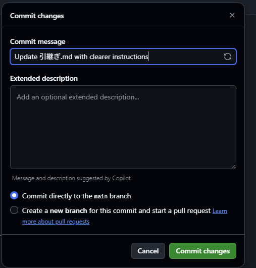

# 引継ぎ
サイトの管理を行っていた人を**先輩**，サイトの管理を引継ぐ人を**後輩**と呼ぶ．

## 引継ぎの仕方

### GitHubのアカウントを所持していない場合
後輩がGitHubのアカウントを所持していない場合，以下の手順によりアカウントを作成する．
1. [GitHub](https://github.com/)にアクセスする
2. サインアップを行い，アカウントを登録する
3. サインインする

> [!WARNING]
> アカウント作成時に登録したE-mailアドレスは必ず保管しておく．Organizationへの招待に必須となる．

サインインが完了したら，Organizationの招待を行う．

### [Organization](https://github.com/handaishogi)に招待
先輩が後輩を阪大将棋部の[Organization](https://github.com/handaishogi)にinviteする．
1. [Organization](https://github.com/handaishogi)をweb上で開く
2. 画面右側のPeople欄にある`invite someone`ボタンを押す
3. 後輩がGitHubに登録したE-mailアドレスを入力し，`invite`ボタンを押す(この時、`owner`か`member`か選べるが、`owner`にしておくこと)
4. 後輩のE-mailアドレス宛に阪大将棋部の[Organization](https://github.com/handaishogi)への招待メールが届くので，参加する

> [!NOTE]
> E-mailアドレスはこれ以降保管する必要はない．

### 後輩が先輩のアカウントを`owner`から`member`に変更する(`owner`が増えすぎることを防ぐため)
1. [Organization](https://github.com/handaishogi)をweb上で開く
2. People欄から先輩のアカウントを見つけ、3点マークを押す
3. `Change role...`から`member`を選択する
> [!NOTE]
> この作業により、先輩はメンバーの追加などを行えなくなる(ファイルの編集等は可能)

### Organizationから抜ける方法(任意)
- 引継ぎが終わり、Organizationから抜けたい場合は以下の手順で行う
1. [Organization](https://github.com/handaishogi)をweb上で開く
2. People欄から**自分**のアカウントを見つけ、3点マークを押す
3. `Manage`を押し、画面左側の`Remove from organization`を押す

## 編集方法

### GitHubの開発に慣れていない場合(プログラミング初心者はこの方法を推奨)
#### 既存ファイルを編集する場合(基本はこっち)
1. 編集したいファイルを選択する
2. 右上にあるペンのマーク(Edit this file)をクリックする
3. ファイルを編集する
4. 編集後、編集結果を保存するなら`Commit changes`を、取り消したいなら`Cancel changes`をクリックする
5. `Commit changes`をクリックすると下のような画面がでるので`Commit message`の部分に編集内容を簡単に表す文を入力した後、`Commit changes`をクリックする。(今は自動生成されるのでそれでもよい。また、他のところは触らないほうがよい)


### GitHubの開発に慣れている場合
1. ここの操作は2通りに分かれる
- リポジトリをローカルにクローンする(初回のみ)
```
git clone https://github.com/handaishogi/HandaiShogiHP.git
```
-  変更を同期する(2回目以降)
```
git pull
```
> [!WARNING]
> 変更の同期は編集を始める前に必ず行うこと。他の人が編集した場合にその変更内容がローカルに反映されてないまま編集してしまうことになる。

2. ファイルを編集する
3. 変更をステージングする
```
git add .
```
4. コミットする(`commit message`には変更内容を表す文を書く。詳しくは`README.md`を参照とのこと。)
```
git commit -m "commit message"
```
5. プッシュする
```
git push
```
## 編集の際の注意点
- 編集するファイルは基本的に`index.md`、`members.md`、`events.md`であり、それぞれトップ、部員紹介、大会実績に対応する
- 上記に挙げたファイルを編集することでサイト内のテキストや画像部分を編集することができる
- 各ファイル冒頭にある以下のような部分は変更しないこと
```
---
title: "部員紹介"
layout: default
---
```
- レイアウトを変更したい場合は、上記のファイルではできないため後述するが、そもそも自信がない限りは変更しないほうが無難である
## ケース別編集する部分
### 部員紹介
- メンバー紹介は2段組み構成となっており、その実装のためhtmlが一部使用されている。以下に示すコードが1まとまりとして考えるとよい
- 利用する際は以下のコードをコピーして貼り付け、所定の部分を編集するとよい
- 逆に編集する場合も編集したい部分がどこに対応するのかを確認し、その部分を変更するとよい
```html
## タイトル(学年など)
<div class="member-row">

<div class="member-col" markdown="1">

左側の行に書く部員

</div>

<div class="member-col" markdown="1">

右側の行に書く部員

</div>

</div>

---
```
### その他
- その他の部分についてはMarkdown記法のみに基づいているため、`Markdownの使い方.md`を参照すること
