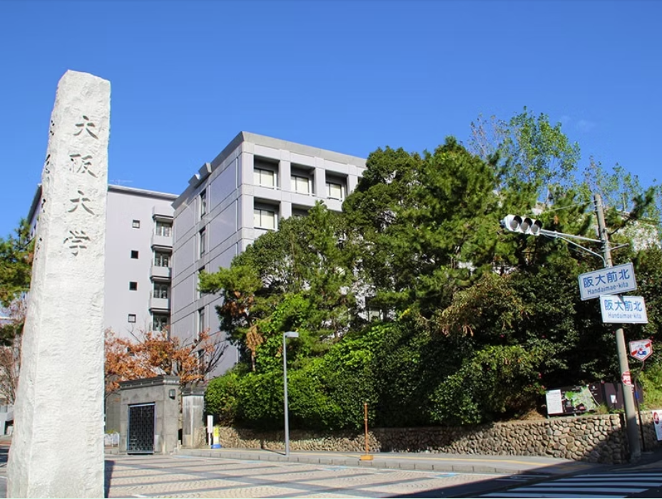

# <u>阪大将棋部HPへようこそ!</u>
将棋部では，将棋を通じた交流を行っています．棋力は初心者から高段者まで様々です．

将棋以外にも，麻雀や他のボードゲームなどでも遊んでいます．

- 活動場所：豊中キャンパス 「明道館」2F (将棋部と書いた看板があります)
- 活動日時：定期活動日は水曜日と金曜日ですが、部室は毎日開放しています

[公式X(旧twitter)](https://twitter.com/handaishogibu)や[ブログ](https://note.com/handai_shogi)もご覧ください。
